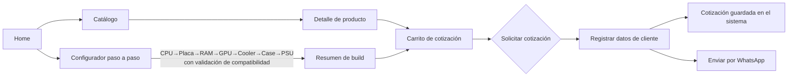
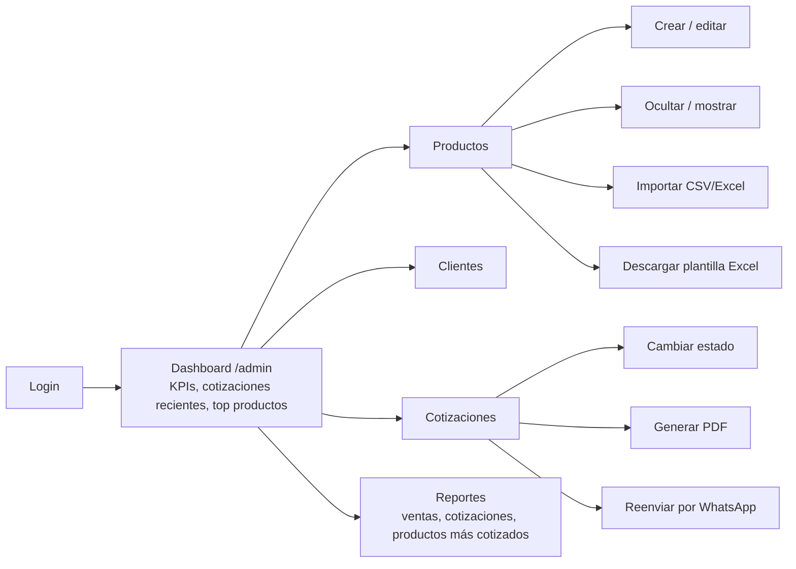

# CyM — Configurador de PCs + CRM

Proyecto final de curso: tienda pública con configurador de PCs y panel administrativo (CRM) para **CyM Computadoras e Ingeniería**, construido sobre la plantilla NextAdmin (Next.js + Prisma/PostgreSQL).

## 1. Tecnologías utilizadas

**Framework y lenguaje**
- [Next.js 16](https://nextjs.org/) (App Router, Turbopack, Server Actions, Proxy) — framework principal, renderiza tanto la tienda pública como el panel admin.
- [React 19.2](https://react.dev/) + TypeScript — toda la UI es tipada de extremo a extremo.

**Base de datos**
- [PostgreSQL](https://www.postgresql.org/) alojado en [Neon](https://neon.tech/) (serverless).
- [Prisma ORM 7](https://www.prisma.io/) — esquema, migraciones y queries tipadas contra la base de datos.

**UI y estilos**
- [Tailwind CSS 4](https://tailwindcss.com/) con tokens semánticos propios (`text-text-*`, `bg-card-*`, etc.), soporte claro/oscuro.
- [React Aria Components](https://react-spectrum.adobe.com/react-aria/) — primitivas accesibles (diálogos, sheets, selects, tooltips) sobre las que se construyó el design system `tailgrids/core`.
- [@tailgrids/icons](https://www.npmjs.com/package/%40tailgrids%2Ficons) — set de íconos del sistema de diseño.
- [country-flag-icons](https://www.npmjs.com/package/country-flag-icons) — banderas SVG (selector de país en el perfil admin).
- [Recharts](https://recharts.org/) — gráficos de la sección de Reportes.

**Datos y estado en el cliente**
- [TanStack Query](https://tanstack.com/query) — fetching, cache e invalidación de datos del servidor.
- [TanStack Table](https://tanstack.com/table) — tablas con orden/filtro/paginación (productos, clientes, cotizaciones).
- Carrito de cotización: store propio con `useSyncExternalStore` + `localStorage` (sin librería externa de estado global).
- [Sonner](https://sonner.emilkowal.ski/) — notificaciones toast.

**Autenticación**
- Login del panel admin implementado a medida: sesión firmada con `node:crypto` (HMAC-SHA256), sin librerías de auth externas. Protegido con `proxy.ts` (en Next.js 16 remplazó a `middleware.ts`).

**Utilidades específicas del negocio**
- [jsPDF](https://github.com/parallax/jsPDF) + `jspdf-autotable` — generación de PDF de cotizaciones.
- [xlsx](https://www.npmjs.com/package/xlsx) (SheetJS) — importación y exportación masiva de productos en CSV/Excel.
- Integración directa con la API de WhatsApp (`wa.me`) para enviar cotizaciones al cliente.

## 2. El problema y cómo se resolvió

**El problema.** CyM Computadoras e Ingeniería arma y vende PCs a medida, pero no tenía un sistema digital para esto:

- Los clientes no podían armar y cotizar su propia PC sin hablar directamente con un vendedor.
- No existía un control de **compatibilidad** entre piezas (socket de CPU vs. placa madre, tipo de memoria, potencia de fuente vs. consumo, tamaño de gabinete vs. largo de la GPU, etc.) — el riesgo de vender una combinación incompatible dependía 100% del conocimiento del vendedor.
- No había un catálogo de productos centralizado ni un panel para gestionarlo (agregar/editar/dar de baja productos, cargar imágenes, etc.).
- La información de clientes y cotizaciones se manejaba de forma manual, sin historial ni reportes.

**La solución.** Se construyó una aplicación con dos frentes que comparten la misma base de datos:

1. **Tienda pública** — el cliente arma su PC paso a paso (CPU → Placa → RAM → GPU → Cooler → Case → PSU). En cada paso, el configurador **filtra automáticamente** las opciones compatibles con lo ya elegido (por ejemplo: si elige un CPU AM5, solo muestra placas con socket AM5) y bloquea combinaciones inválidas con mensajes explicativos, replicando en software el criterio que antes dependía de un vendedor. Al terminar, el cliente puede agregar productos sueltos o su build completa a un carrito de cotización y enviarla por WhatsApp o registrarla directamente en el sistema.
2. **Panel administrativo (CRM)** — protegido con login, permite gestionar el catálogo completo (crear/editar/ocultar productos, importar o exportar el inventario en CSV/Excel, cargar imágenes referenciales), administrar clientes, dar seguimiento a cotizaciones (cambiar su estado, generar PDF, reenviar por WhatsApp) y ver reportes con KPIs reales (ventas por período, productos más cotizados, etc.), todo conectado a los mismos datos que ve la tienda — sin planillas ni sistemas separados.

## 3. Demostración del flujo de la aplicación

### Flujo del cliente (tienda pública)

1. El cliente entra a la tienda y navega el **catálogo** (con filtros por categoría) o usa el **configurador** guiado.
2. En el configurador, cada paso ya viene filtrado según lo elegido antes; si algo es incompatible, el sistema lo bloquea y explica por qué.
3. Los productos elegidos (sueltos desde el catálogo o desde una build completa) van al **carrito de cotización**, que persiste en el navegador aunque recargue la página.
4. Al solicitar la cotización, se piden los datos del cliente, se registra en el sistema (queda disponible para el admin) y se puede reenviar por WhatsApp con el detalle y el total.

### Flujo del administrador (CRM)

1. El admin inicia sesión (usuario/clave únicos, sesión con cookie firmada); cualquier intento de entrar a `/admin`, `/productos`, `/clientes`, `/cotizaciones`, `/reportes` o `/profile` sin sesión válida redirige a `/login`.
2. Desde **Productos** puede dar de alta un producto a mano, o cargar el inventario completo con **Importar CSV/Excel** (descargando antes la plantilla con **Descargar Excel** para saber qué columnas llenar). Un producto que ya no se debe vender se **oculta** en vez de borrarse (para no perder su historial en cotizaciones pasadas), y desaparece automáticamente del catálogo público.
3. En **Cotizaciones** ve todas las solicitudes generadas desde la tienda, puede validarlas, cambiar su estado (Borrador/Confirmada/Rechazada), generar el PDF y reenviarlo por WhatsApp.
4. En **Reportes** consulta KPIs reales calculados sobre la misma base de datos: ventas por período, cotizaciones generadas vs. confirmadas, productos más cotizados.
